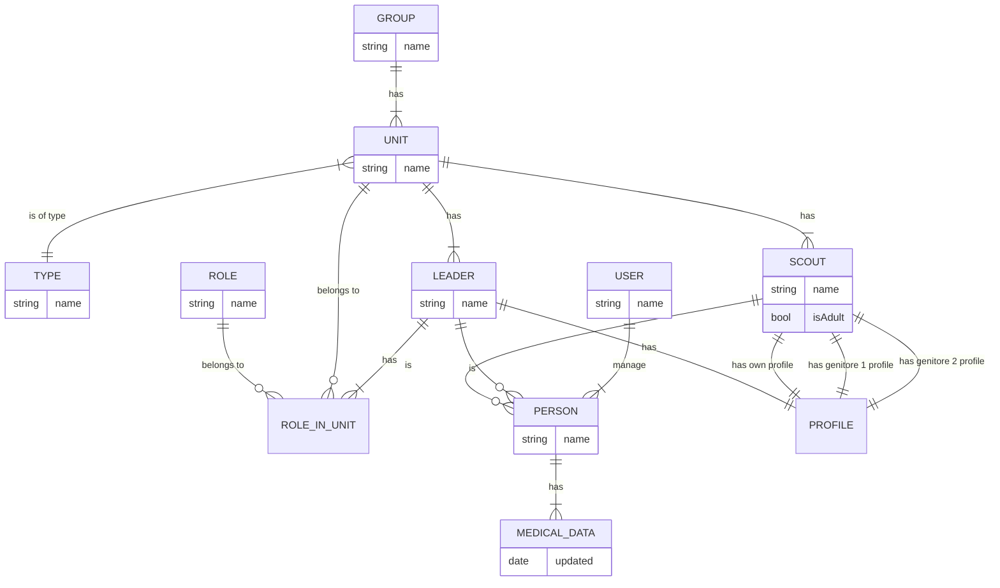

# 1. Record architecture decisions

Date: 2024-08-28

## Status

Accepted

## Context

Creazione di una web-app per la gestione dei dati delle schede mediche degli educandi scout.

## Decision

Lo schema delle entità e delle relative relazioni è illustrato qui di seguito.

### Descrizione in linguaggio naturale:

Gestisce i _gruppi_ scout e le relative _unità_ (branco, reparto, clan, ecc.).  
Ogni gruppo ha dei membri che possono essere capi (leader, educatori) e gli educandi (d'ora in poi chiamati solo
_scout_),
tipicamente questi ultimi sono minorenni e non avranno accesso al sito.
Legato ai _leader_ e agli _scout_ sono legati il proprio profilo e per gli _scout_ anche il profilo dei due genitori.

Sempre ai _leader_ e agli _scout_ sono legati le entità _persona_, queste possono essere gestite dagli utenti del
sito.  
Ogni utente del sito può "gestire" diverse "persone", ad esempio un capo (leader) può gestire gli scout della propria
unità
e un genitore gestirà uno o più _scout_.

### Schema:

## Consequences

Questo ha portato alla generazione delle varie entità di cui è composta l'applicazione.
